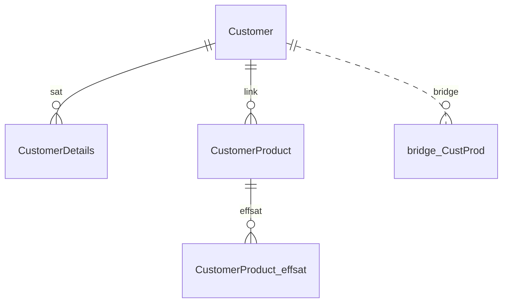

# Phase 11: Output Completeness - Research

**Researched:** 2026-04-08
**Domain:** Code generation (SQL Jinja + Spark DLT), documentation generation, CLI flag extension
**Confidence:** HIGH

## Summary

Phase 11 wires the last two ungenerated entity types (EffSat, SamLink) into both generators, expands the docs generator to cover all 6 new entity types with Mermaid ER diagrams, and adds a `--dialect` CLI flag. All implementation targets are pure extensions to existing code — no architectural changes are needed.

The codebase has a clean, consistent pattern for every entity type: one Jinja2 template + one generator loop (SQL Jinja), one `_generate_{type}()` method (Spark DLT), and one `_{type}_section()` function (markdown docs). EffSat and SamLink fit into these patterns directly. The `SqlJinjaGenerator` already accepts a `dialect=` constructor parameter; wiring it through the CLI is a single Typer option addition.

All 173 existing tests pass. The test file `tests/test_generators.py` provides the exact scaffolding pattern for new generator tests. Domain model classes `EffSat` and `SamLink` are already defined in `model/core.py`, and `DataVaultModel` already has `effsats` and `samlinks` dicts — the generators simply don't iterate them yet.

**Primary recommendation:** Implement in 4 independent streams — EffSat generation, SamLink generation, docs expansion, CLI flag — with tests for each. All streams are non-interfering and can be planned as separate tasks within the same wave.

---

<user_constraints>
## User Constraints (from CONTEXT.md)

### Locked Decisions

#### EffSat Code Generation
- **D-01:** EffSat SQL uses MERGE INTO pattern (not INSERT). Temporal validity records are updated when validity periods change. Same MERGE shape as nhsat template.
- **D-02:** EffSat Spark DLT uses `dlt.apply_changes(stored_as_scd_type=1)` — MERGE semantics matching the SQL pattern.
- **D-03:** EffSat output files go in `satellites/` directory (filename: `effsat_{name}.sql` or `effsat_{name}.py`). Consistent with nhsat convention from Phase 8.

#### SamLink Code Generation
- **D-04:** SamLink SQL uses MERGE INTO pattern. Deduplication relationships may be updated over time.
- **D-05:** SamLink Spark DLT uses `dlt.apply_changes(stored_as_scd_type=1)` — MERGE semantics.
- **D-06:** SamLink output files go in `links/` directory (filename: `samlink_{name}.sql` or `samlink_{name}.py`). Consistent with nhlink convention from Phase 8.

#### Docs Generator Expansion (DOC-01)
- **D-07:** Documentation grouped by category: "Raw Vault" (hubs, links, satellites, nhsat, nhlink, effsat, samlink) and "Query Assist" (bridge, pit). Each entity type gets its own subsection with columns table.
- **D-08:** Bridge docs show path chain. PIT docs show anchor hub and tracked satellites list.
- **D-09:** NhSat/NhLink docs show parent ref and columns like their historized counterparts.
- **D-10:** EffSat docs show parent ref (link). SamLink docs show master and duplicate refs.

#### Mermaid ER Diagrams (DOC-02)
- **D-11:** Single erDiagram block per model covering all entity types and their relationships.
- **D-12:** Diagram placed at the top of the docs output, before detailed sections. Overview-first layout.
- **D-13:** Relationship notation: satellites use `||--o{`, links connect multiple hubs, effsat attaches to links, samlink shows master/duplicate, bridge/pit use dotted lines (`||..o{`).

#### CLI --dialect Flag (CLI-01)
- **D-14:** `--dialect` flag added to the `generate` command. Only applies when `--target sql-jinja`. Choices: `default`, `postgres`, `spark`. Default value: `default`.
- **D-15:** If `--dialect` is used with a non-sql-jinja target (e.g., spark-declarative), emit a warning and ignore the flag. Don't error.
- **D-16:** The existing `SqlJinjaGenerator(dialect=)` constructor parameter is wired to the CLI flag. No changes to generator internals needed.

### Claude's Discretion
- MERGE match key details for effsat and samlink across dialects
- Exact Mermaid relationship cardinality annotations
- `_effsat_section()` and `_samlink_section()` markdown formatting details
- EffSat/SamLink `apply_changes()` parameter tuning (sequence_by, track_history, etc.)
- Test fixture design for effsat/samlink generation

### Deferred Ideas (OUT OF SCOPE)
None — discussion stayed within phase scope.
</user_constraints>

---

<phase_requirements>
## Phase Requirements

| ID | Description | Research Support |
|----|-------------|------------------|
| GEN-01 | SQL Jinja generates correct SQL for all 6 new entity types | EffSat/SamLink templates follow nhsat/nhlink MERGE pattern exactly. Generator loops in `SqlJinjaGenerator.generate()` need 2 new blocks. |
| GEN-02 | Spark Declarative generates correct DLT Python for all 6 new entity types | EffSat/SamLink Spark methods follow `_generate_nhsat()`/`_generate_nhlink()` pattern. `apply_changes(stored_as_scd_type=1)` confirmed. |
| DOC-01 | Markdown docs generator covers all 6 new entity types | `generate_markdown()` restructure: add Raw Vault/Query Assist grouping + 6 new `_{type}_section()` functions. |
| DOC-02 | Docs generator produces Mermaid entity-relationship diagrams | Single `erDiagram` block at top of output; relationship notation locked via D-11 through D-13. |
| CLI-01 | User can pass `--dialect` flag to `dmjedi generate` for SQL Jinja dialect selection | `SqlJinjaGenerator` already has `dialect=` constructor param; wire via `typer.Option`. D-14/D-15/D-16 fully specify behavior. |
</phase_requirements>

---

## Standard Stack

### Core (all pre-installed, no new dependencies)
| Library | Version | Purpose | Why Standard |
|---------|---------|---------|--------------|
| Jinja2 | already in project | SQL template rendering | Used by SqlJinjaGenerator; existing templates are the pattern [VERIFIED: codebase] |
| Typer | already in project | CLI option parsing | Used by all commands; `typer.Option()` pattern is established [VERIFIED: codebase] |
| Pydantic v2 | already in project | Domain model classes | All entities are `BaseModel`; `EffSat`, `SamLink` already defined [VERIFIED: codebase] |

No new packages are required. [VERIFIED: codebase grep of imports]

**Installation:** none needed.

---

## Architecture Patterns

### SQL Jinja Generator: One Template + One Loop

Every entity type in `SqlJinjaGenerator.generate()` follows this pattern [VERIFIED: codebase]:

```python
# Source: src/dmjedi/generators/sql_jinja/generator.py
nhsat_tpl = env.get_template("nhsat.sql.j2")
for nhsat in model.nhsats.values():
    result.add_file(
        f"satellites/nhsat_{nhsat.name}.sql", nhsat_tpl.render(nhsat=nhsat)
    )
```

For EffSat and SamLink, add two equivalent blocks after the nhlink block.

### EffSat SQL Template Shape (Claude's Discretion)

Based on nhsat template pattern (D-01: same MERGE shape) [VERIFIED: codebase — nhsat.sql.j2]:

```jinja2
-- EffSat: {{ effsat.name }} (parent: {{ effsat.parent_ref }})
-- Generated by DMJEDI (effectivity satellite: MERGE/overwrite semantics)

MERGE INTO {{ effsat.name }} AS target
USING src_{{ effsat.name }} AS source
ON target.{{ effsat.parent_ref }}_hk = source.{{ effsat.parent_ref }}_hk
WHEN MATCHED THEN
    UPDATE SET
        target.load_ts = source.load_ts,
        target.record_source = source.record_source,

        target.{{ col.name }} = source.{{ col.name }},

WHEN NOT MATCHED THEN
    INSERT ({{ effsat.parent_ref }}_hk, load_ts, record_source, {{ col.name }}, )
    VALUES (source.{{ effsat.parent_ref }}_hk, source.load_ts, source.record_source, source.{{ col.name }}, );
```

MERGE key is `parent_ref}_hk` (the link hash key). This matches D-01 and the CONTEXT.md specifics note ("EffSat MERGE key: parent link hash key").

### SamLink SQL Template Shape (Claude's Discretion)

Based on nhlink template pattern (D-04: same MERGE shape) [VERIFIED: codebase — nhlink.sql.j2]. SamLink has `master_ref` and `duplicate_ref` instead of `hub_references` list [VERIFIED: codebase — model/core.py]:

```jinja2
-- SamLink: {{ samlink.name }}
-- Generated by DMJEDI (same-as link: MERGE/overwrite semantics)

MERGE INTO {{ samlink.name }} AS target
USING src_{{ samlink.name }} AS source
ON target.{{ samlink.name }}_hk = source.{{ samlink.name }}_hk
WHEN MATCHED THEN
    UPDATE SET
        target.load_ts = source.load_ts,
        target.record_source = source.record_source,
        target.{{ samlink.master_ref }}_hk = source.{{ samlink.master_ref }}_hk,
        target.{{ samlink.duplicate_ref }}_hk = source.{{ samlink.duplicate_ref }}_hk,

        target.{{ col.name }} = source.{{ col.name }},

WHEN NOT MATCHED THEN
    INSERT ({{ samlink.name }}_hk, load_ts, record_source, {{ samlink.master_ref }}_hk, {{ samlink.duplicate_ref }}_hk, {{ col.name }}, )
    VALUES (source.{{ samlink.name }}_hk, source.load_ts, source.record_source, source.{{ samlink.master_ref }}_hk, source.{{ samlink.duplicate_ref }}_hk, source.{{ col.name }}, );
```

MERGE key is `{samlink.name}_hk` (computed from master_hk + duplicate_hk as noted in CONTEXT.md specifics).

### Spark DLT Generator: One `_generate_{type}()` Method

Every entity type in `SparkDeclarativeGenerator` follows this pattern [VERIFIED: codebase]:

```python
# Source: src/dmjedi/generators/spark_declarative/generator.py
for nhsat in model.nhsats.values():
    result.add_file(
        f"satellites/nhsat_{nhsat.name}.py", self._generate_nhsat(nhsat)
    )
```

Add equivalent loops and private methods for EffSat and SamLink.

### EffSat Spark DLT Shape (Claude's Discretion — apply_changes pattern)

Mirrors `_generate_nhsat()` (D-02: same `dlt.apply_changes(stored_as_scd_type=1)`) [VERIFIED: codebase]:

```python
# Source pattern: src/dmjedi/generators/spark_declarative/generator.py _generate_nhsat()
def _generate_effsat(self, effsat: EffSat) -> str:
    table_name = f"effsat_{effsat.name}"
    return (
        f"{_IMPORTS}\n\n"
        f"@dlt.table(\n"
        f'    name="{table_name}",\n'
        f'    comment="EffSat: {effsat.name} (parent link: {effsat.parent_ref}) — current-state"\n'
        f")\n"
        f"def {table_name}_target():\n"
        f'    """Schema definition for effectivity satellite {effsat.name}."""\n'
        f"    pass\n\n"
        f"dlt.apply_changes(\n"
        f'    target="{table_name}",\n'
        f'    source="src_{effsat.name}",\n'
        f'    keys=["{effsat.parent_ref}_hk"],\n'
        f'    sequence_by=F.col("load_ts"),\n'
        f"    stored_as_scd_type=1,\n"
        f")\n"
    )
```

### SamLink Spark DLT Shape (Claude's Discretion — apply_changes pattern)

Mirrors `_generate_nhlink()` (D-05) [VERIFIED: codebase]:

```python
def _generate_samlink(self, samlink: SamLink) -> str:
    table_name = f"samlink_{samlink.name}"
    return (
        f"{_IMPORTS}\n\n"
        f"@dlt.table(\n"
        f'    name="{table_name}",\n'
        f'    comment="SamLink: {samlink.name} — current-state"\n'
        f")\n"
        f"def {table_name}_target():\n"
        f'    """Schema definition for same-as link {samlink.name}."""\n'
        f"    pass\n\n"
        f"dlt.apply_changes(\n"
        f'    target="{table_name}",\n'
        f'    source="src_{samlink.name}",\n'
        f'    keys=["{samlink.name}_hk"],\n'
        f'    sequence_by=F.col("load_ts"),\n'
        f"    stored_as_scd_type=1,\n"
        f")\n"
    )
```

The Spark generator import line must add `EffSat, SamLink` to its `from dmjedi.model.core import ...` statement.

### Docs Generator Restructure

Current `generate_markdown()` has a flat structure: Hubs > Links > Satellites [VERIFIED: codebase — docs/markdown.py].

New structure (D-07, D-12):

```python
# Overview-first: Mermaid diagram at top
sections = ["# Data Vault Model Documentation\n"]
sections.append(_mermaid_diagram(model))   # placed BEFORE entity sections

# Raw Vault group
sections.append("## Raw Vault\n")
sections.append("### Hubs\n") + hub sections
sections.append("### Links\n") + link sections
sections.append("### Satellites\n") + satellite sections
sections.append("### Non-Historized Satellites\n") + nhsat sections
sections.append("### Non-Historized Links\n") + nhlink sections
sections.append("### Effectivity Satellites\n") + effsat sections
sections.append("### Same-As Links\n") + samlink sections

# Query Assist group
sections.append("## Query Assist\n")
sections.append("### Bridges\n") + bridge sections
sections.append("### Point-in-Time Tables\n") + pit sections
```

Each new `_{type}_section()` follows the exact signature and return shape of existing section functions [VERIFIED: codebase — docs/markdown.py]:
- `_effsat_section(effsat: EffSat) -> str` — shows `qualified_name`, `parent_ref`, columns table
- `_samlink_section(samlink: SamLink) -> str` — shows `qualified_name`, `master_ref`, `duplicate_ref`, columns table
- `_nhsat_section(nhsat: NhSat) -> str` — shows `qualified_name`, `parent_ref`, columns table
- `_nhlink_section(nhlink: NhLink) -> str` — shows `qualified_name`, hub_references, columns table
- `_bridge_section(bridge: Bridge) -> str` — shows `qualified_name`, path chain (D-08)
- `_pit_section(pit: Pit) -> str` — shows `qualified_name`, `anchor_ref`, `tracked_satellites` list (D-08)

The import line in `docs/markdown.py` must be expanded to include all new types.

### Mermaid erDiagram Generation (Claude's Discretion)

Mermaid `erDiagram` syntax for a Data Vault model [ASSUMED — based on Mermaid documentation knowledge]:

```markdown

```

Key implementation decisions for `_mermaid_diagram(model)` (all Claude's Discretion per CONTEXT.md):

- **Entity labels**: Use bare entity name (no namespace prefix) for readability
- **Hub→Satellite**: `HUB ||--o{ SAT : "sat"` (D-13: `||--o{`)
- **Hub→Link (each hub ref)**: `HUB ||--o{ LINK : "link"` (D-13: links connect multiple hubs)
- **Link→EffSat**: `LINK ||--o{ EFFSAT : "effsat"` (D-13: effsat attaches to links)
- **SamLink (master and duplicate)**: `HUB ||--o{ SAMLINK : "master"` and `HUB ||--o{ SAMLINK : "duplicate"` (D-13: samlink shows master/duplicate)
- **Bridge**: `HUB ||..o{ BRIDGE : "bridge"` (D-13: dotted lines `||..o{`)
- **PIT**: `HUB ||..o{ PIT : "pit"` (D-13: dotted lines)
- When model is empty, output empty `erDiagram` block (no error)

Mermaid `erDiagram` requires entity names to be valid identifiers (no dots, no hyphens). Strip namespace prefix (take the part after the last `.`).

### CLI --dialect Flag

Current `generate` command signature [VERIFIED: codebase — cli/main.py]:

```python
@app.command()
def generate(
    paths: list[Path] = typer.Argument(..., help="DVML files or directories"),
    target: str = typer.Option("spark-declarative", "--target", "-t", help="Generator target"),
    output: Path = typer.Option("output", "--output", "-o", help="Output directory"),
) -> None:
```

Add (D-14, D-16):

```python
    dialect: str = typer.Option("default", "--dialect", help="SQL dialect (default, postgres, spark). Only applies to --target sql-jinja."),
```

Wiring logic (D-15 — warn but don't error for non-sql-jinja targets):

```python
    try:
        gen = registry.get(target)
    except KeyError as e:
        ...

    # Wire dialect: only meaningful for sql-jinja
    if dialect != "default" and target != "sql-jinja":
        console.print("[yellow]Warning:[/yellow] --dialect is only used with --target sql-jinja; ignoring.")

    if target == "sql-jinja":
        from dmjedi.generators.sql_jinja.generator import SqlJinjaGenerator
        gen = SqlJinjaGenerator(dialect=dialect)
```

**Registry concern:** The registry currently stores a single `SqlJinjaGenerator()` instance with `dialect="default"`. The CLI must instantiate a fresh `SqlJinjaGenerator(dialect=dialect)` directly when `target == "sql-jinja"` rather than using the registered instance. This bypasses the registered default. [VERIFIED: codebase — registry.py registers `SqlJinjaGenerator()` with no dialect arg]

### Anti-Patterns to Avoid

- **Touching generator internals for dialect**: D-16 says no changes to generator internals — just wire the constructor param that already exists.
- **Failing on --dialect with non-sql target**: D-15 explicitly says warn and ignore, not error.
- **Column names in Spark apply_changes output**: The nhsat/nhlink pattern explicitly does NOT include column names in DLT apply_changes output (schema is inferred at runtime). EffSat and SamLink must follow the same convention [VERIFIED: codebase — comment in `_generate_nhsat()`].
- **Adding namespace prefix to Mermaid entity names**: Dots in entity names break Mermaid parser — always strip to bare name.
- **Changing existing section function signatures**: New section functions must match the existing `_{type}_section(entity) -> str` signature.

---

## Don't Hand-Roll

| Problem | Don't Build | Use Instead | Why |
|---------|-------------|-------------|-----|
| Type mapping for new entities | Custom type conversion | Existing `map_type()` in `model/types.py` | Already handles all dialects, param-aware |
| MERGE template logic | Custom MERGE SQL string formatting | Jinja2 template (`effsat.sql.j2`, `samlink.sql.j2`) | Consistent with 5 existing templates; whitespace control already solved |
| apply_changes boilerplate | Custom string builder | Follow `_generate_nhsat()` pattern exactly | Tested pattern, no historized fields, schema inferred at runtime |
| Mermaid syntax validation | Custom diagram validator | Mermaid's own parser validates at render time | Docs are human-consumed; render errors are visible |

---

## Common Pitfalls

### Pitfall 1: Trailing Comma in MERGE INSERT column list
**What goes wrong:** Jinja2 `` logic for MERGE INSERT column lists produces `,)` when `columns` is empty but there are also hub-ref columns (or vice versa).
**Why it happens:** The nhlink template has this exact bug risk — it uses a compound condition `` to handle the boundary between hub refs and extra columns.
**How to avoid:** Study nhlink.sql.j2 carefully. Use `_assert_valid_sql()` helper from test_generators.py on every new template. Test with zero columns AND with columns.
**Warning signs:** `_assert_valid_sql()` assertion on `,)` pattern.

### Pitfall 2: SamLink Has No `hub_references` List
**What goes wrong:** Developer tries to iterate `samlink.hub_references` like NhLink — the field doesn't exist on `SamLink`.
**Why it happens:** `SamLink` has `master_ref: str` and `duplicate_ref: str` (two named refs), not `hub_references: list[str]` [VERIFIED: codebase — model/core.py].
**How to avoid:** Access `samlink.master_ref` and `samlink.duplicate_ref` directly in both template and Spark method.

### Pitfall 3: Spark Generator Import Missing EffSat/SamLink
**What goes wrong:** `NameError: name 'EffSat' is not defined` at runtime.
**Why it happens:** The Spark generator's import line currently only imports `Bridge, DataVaultModel, Hub, Link, NhLink, NhSat, Pit, Satellite` [VERIFIED: codebase — line 4 of spark generator].
**How to avoid:** Add `EffSat, SamLink` to the import in `spark_declarative/generator.py`.

### Pitfall 4: Registry Returns Dialect-Unaware Instance
**What goes wrong:** `--dialect postgres` has no effect because `registry.get("sql-jinja")` returns the instance registered with `dialect="default"`.
**Why it happens:** The registry auto-registers `SqlJinjaGenerator()` at import time [VERIFIED: codebase — registry.py line 32].
**How to avoid:** In the CLI `generate()` function, when `target == "sql-jinja"`, instantiate `SqlJinjaGenerator(dialect=dialect)` directly instead of using `registry.get(target)`.

### Pitfall 5: Mermaid erDiagram With Namespace-Prefixed Names
**What goes wrong:** Mermaid renders an error or silently drops relationships for entity names like `sales.Customer`.
**Why it happens:** Mermaid `erDiagram` entity names must be valid identifiers — dots break the parser. [ASSUMED — based on Mermaid syntax knowledge]
**How to avoid:** Strip namespace: use `name.split(".")[-1]` or access the entity's `.name` attribute (not `.qualified_name`).

### Pitfall 6: Docs Grouping Sections for Empty Entity Collections
**What goes wrong:** Output includes empty `### Non-Historized Satellites` section header with no content.
**Why it happens:** Current `generate_markdown()` already guards with `if model.hubs:` — new sections must do the same.
**How to avoid:** Wrap each new section group in `if model.effsats:`, `if model.samlinks:`, etc.

---

## Code Examples

### Verified: Current SQL Jinja Generator Loop Structure
```python
# Source: src/dmjedi/generators/sql_jinja/generator.py
nhsat_tpl = env.get_template("nhsat.sql.j2")
for nhsat in model.nhsats.values():
    result.add_file(
        f"satellites/nhsat_{nhsat.name}.sql", nhsat_tpl.render(nhsat=nhsat)
    )
```
New effsat block goes after nhlink block, before bridge block. New samlink block goes after effsat block, before bridge block.

### Verified: Current Spark DLT apply_changes Pattern
```python
# Source: src/dmjedi/generators/spark_declarative/generator.py
def _generate_nhsat(self, nhsat: NhSat) -> str:
    table_name = f"nhsat_{nhsat.name}"
    return (
        f"{_IMPORTS}\n\n"
        f"@dlt.table(\n"
        f'    name="{table_name}",\n'
        f'    comment="NhSat: {nhsat.name} (parent: {nhsat.parent_ref}) — current-state"\n'
        f")\n"
        f"def {table_name}_target():\n"
        f'    """Schema definition for non-historized satellite {nhsat.name}."""\n'
        f"    pass\n\n"
        f"dlt.apply_changes(\n"
        f'    target="{table_name}",\n'
        f'    source="src_{nhsat.name}",\n'
        f'    keys=["{nhsat.parent_ref}_hk"],\n'
        f'    sequence_by=F.col("load_ts"),\n'
        f"    stored_as_scd_type=1,\n"
        f")\n"
    )
```

### Verified: Current Docs Section Pattern
```python
# Source: src/dmjedi/docs/markdown.py
def _satellite_section(sat: Satellite) -> str:
    lines = [f"### {sat.qualified_name}\n", f"**Parent:** `{sat.parent_ref}`\n"]
    if sat.columns:
        lines.append("**Columns:**\n")
        lines.append("| Name | Type |")
        lines.append("|------|------|")
        for col in sat.columns:
            lines.append(f"| `{col.name}` | `{col.data_type}` |")
        lines.append("")
    return "\n".join(lines)
```

### Verified: EffSat Domain Model Fields
```python
# Source: src/dmjedi/model/core.py
class EffSat(BaseModel):
    name: str
    namespace: str = ""
    parent_ref: str      # references a link (not a hub)
    columns: list[Column] = []
```

### Verified: SamLink Domain Model Fields
```python
# Source: src/dmjedi/model/core.py
class SamLink(BaseModel):
    name: str
    namespace: str = ""
    master_ref: str      # hub reference — same hub as duplicate_ref
    duplicate_ref: str   # hub reference — same hub as master_ref
    columns: list[Column] = []
```

### Verified: Test Pattern for New Generator Tests
```python
# Source: tests/test_generators.py — existing nhsat/nhlink/bridge/pit test structure
def test_sql_effsat_output_valid():
    model = DataVaultModel(
        effsats={
            "s.EffSatFoo": EffSat(
                name="EffSatFoo", namespace="s", parent_ref="MyLink",
                columns=[Column(name="load_end_date", data_type="date")],
            )
        },
    )
    gen = registry.get("sql-jinja")
    result = gen.generate(model)
    assert "satellites/effsat_EffSatFoo.sql" in result.files
    sql = result.files["satellites/effsat_EffSatFoo.sql"]
    _assert_valid_sql(sql)
    assert "MERGE INTO" in sql
    assert "MyLink_hk" in sql
    assert "load_end_date" in sql
```

---

## State of the Art

| Old Approach | Current Approach | Impact |
|--------------|------------------|--------|
| Docs covered only hub/link/sat | Docs will cover all 9 entity types in 2 groups | End-user can understand full model from generated docs |
| No ER diagrams | Mermaid erDiagram at top of docs | Visual overview of model structure |
| No dialect flag in CLI | `--dialect` flag on generate command | Users can target postgres/spark SQL without code changes |
| EffSat/SamLink missing from generators | Both generators support all 6 new entity types | GEN-01/GEN-02 compliance complete |

---

## Assumptions Log

| # | Claim | Section | Risk if Wrong |
|---|-------|---------|---------------|
| A1 | Mermaid `erDiagram` entity names must be valid identifiers (no dots) | Architecture Patterns, Common Pitfalls | Low — Mermaid rendering error is visible; fix is trivial (already recommended: strip namespace) |
| A2 | Mermaid `||..o{` syntax produces dotted lines for bridge/pit relationship notation (D-13) | Architecture Patterns | Low — if syntax is wrong, diagram renders incorrectly; can be verified during implementation by rendering the output |

**All other claims were verified by reading the codebase directly.**

---

## Open Questions

1. **Should `--dialect` choices be validated by Typer or at SqlJinjaGenerator level?**
   - What we know: `SUPPORTED_DIALECTS = ["default", "postgres", "spark"]` exists in `model/types.py` [VERIFIED: codebase]. Typer supports `click.Choice` via an enum or list.
   - What's unclear: Whether to add a Typer `Enum` type or a plain string with runtime validation.
   - Recommendation: Use `typer.Option(..., help="...", show_default=True)` with a plain string and document valid values in the help text. If dialect is unknown, `map_type()` falls back gracefully to `"default"` behavior. This keeps the CLI simple and avoids an import cycle.

2. **Does `generate_markdown()` need to handle models with zero entities gracefully?**
   - What we know: The current function returns `"# Data Vault Model Documentation\n"` with no sections for an empty model. The Mermaid diagram section would output an empty `erDiagram` block.
   - Recommendation: Emit the `erDiagram` block regardless (even if empty) since it's valid Mermaid syntax. Guard each entity section group with `if model.{collection}:`.

---

## Environment Availability

Step 2.6: SKIPPED — Phase 11 is purely code/config changes extending existing modules. All dependencies (Jinja2, Typer, Pydantic, pytest) are already present. Confirmed: `uv run pytest` passes 173 tests in the current environment. [VERIFIED: ran `uv run pytest -q --tb=no`]

---

## Validation Architecture

### Test Framework
| Property | Value |
|----------|-------|
| Framework | pytest (via `uv run pytest`) |
| Config file | `pyproject.toml` (standard pytest discovery) |
| Quick run command | `uv run pytest tests/test_generators.py -q` |
| Full suite command | `uv run pytest -q` |

### Phase Requirements → Test Map
| Req ID | Behavior | Test Type | Automated Command | File Exists? |
|--------|----------|-----------|-------------------|-------------|
| GEN-01 | EffSat SQL: MERGE INTO, parent_ref_hk match key, columns, `satellites/effsat_{name}.sql` | unit | `uv run pytest tests/test_generators.py -k "effsat" -x` | ❌ Wave 0 |
| GEN-01 | SamLink SQL: MERGE INTO, samlink_hk match key, master/duplicate refs, `links/samlink_{name}.sql` | unit | `uv run pytest tests/test_generators.py -k "samlink" -x` | ❌ Wave 0 |
| GEN-01 | SQL valid syntax (no trailing commas) for effsat/samlink with and without columns | unit | `uv run pytest tests/test_generators.py -k "effsat or samlink" -x` | ❌ Wave 0 |
| GEN-02 | EffSat Spark: `apply_changes`, `stored_as_scd_type=1`, `parent_ref_hk` key, no column names | unit | `uv run pytest tests/test_generators.py -k "spark_effsat" -x` | ❌ Wave 0 |
| GEN-02 | SamLink Spark: `apply_changes`, `stored_as_scd_type=1`, `samlink_hk` key | unit | `uv run pytest tests/test_generators.py -k "spark_samlink" -x` | ❌ Wave 0 |
| DOC-01 | generate_markdown() includes sections for all 6 new types, Raw Vault / Query Assist grouping | unit | `uv run pytest tests/test_docs.py -x` | ❌ Wave 0 |
| DOC-02 | generate_markdown() output starts with ```mermaid\nerDiagram block | unit | `uv run pytest tests/test_docs.py -k "mermaid" -x` | ❌ Wave 0 |
| CLI-01 | `dmjedi generate --dialect postgres` passes postgres dialect to SqlJinjaGenerator | unit/integration | `uv run pytest tests/test_cli.py -k "dialect" -x` | Partial (test_cli.py exists, no dialect tests) |

### Sampling Rate
- **Per task commit:** `uv run pytest tests/test_generators.py tests/test_docs.py -q`
- **Per wave merge:** `uv run pytest -q`
- **Phase gate:** Full suite green before `/gsd-verify-work`

### Wave 0 Gaps
- [ ] `tests/test_docs.py` — covers DOC-01 (all entity types in markdown), DOC-02 (Mermaid diagram)
- [ ] Generator tests for effsat/samlink added to `tests/test_generators.py` (extend existing file, not new file)
- [ ] CLI dialect tests added to `tests/test_cli.py` (if file exists) or created

*(Existing `tests/test_generators.py` with 34 tests is confirmed. `tests/test_docs.py` does not exist — confirmed via test suite listing.)*

---

## Security Domain

This phase involves no authentication, session management, access control, cryptography, or user input parsing beyond CLI flags. The `--dialect` flag accepts a constrained string value from a known set. No ASVS categories apply to code generation, documentation rendering, or local file writes. Security enforcement section omitted as not applicable to this domain.

---

## Sources

### Primary (HIGH confidence)
- `/Users/kevin_haferkamp/Projects/dmjedi/src/dmjedi/generators/sql_jinja/generator.py` — SqlJinjaGenerator loop structure, dialect parameter
- `/Users/kevin_haferkamp/Projects/dmjedi/src/dmjedi/generators/spark_declarative/generator.py` — All `_generate_*` methods, apply_changes pattern, import line
- `/Users/kevin_haferkamp/Projects/dmjedi/src/dmjedi/generators/sql_jinja/templates/nhsat.sql.j2` — MERGE template pattern for EffSat
- `/Users/kevin_haferkamp/Projects/dmjedi/src/dmjedi/generators/sql_jinja/templates/nhlink.sql.j2` — MERGE template pattern for SamLink
- `/Users/kevin_haferkamp/Projects/dmjedi/src/dmjedi/model/core.py` — EffSat, SamLink, DataVaultModel field definitions
- `/Users/kevin_haferkamp/Projects/dmjedi/src/dmjedi/model/types.py` — SUPPORTED_DIALECTS, map_type()
- `/Users/kevin_haferkamp/Projects/dmjedi/src/dmjedi/docs/markdown.py` — generate_markdown(), section function signatures
- `/Users/kevin_haferkamp/Projects/dmjedi/src/dmjedi/cli/main.py` — generate() command signature, registry.get() usage
- `/Users/kevin_haferkamp/Projects/dmjedi/src/dmjedi/generators/registry.py` — auto-register pattern, default SqlJinjaGenerator instance
- `/Users/kevin_haferkamp/Projects/dmjedi/tests/test_generators.py` — Test scaffolding patterns, `_assert_valid_sql()`
- `uv run pytest -q --tb=no` — 173 tests passing, confirmed environment

### Secondary (MEDIUM confidence)
- CONTEXT.md D-01 through D-16 — locked implementation decisions from user discussion

### Tertiary (LOW confidence)
- A1: Mermaid erDiagram entity name constraint (dots not allowed) — training knowledge, verify by attempting to render
- A2: Mermaid `||..o{` dotted line syntax — training knowledge, verify during implementation

---

## Metadata

**Confidence breakdown:**
- Standard stack: HIGH — all code verified by direct codebase read
- Architecture: HIGH — patterns verified by reading every relevant source file
- Pitfalls: HIGH (P1-P4) / MEDIUM (P5-P6) — P1-P4 verified in code; P5-P6 partly assumed (Mermaid behavior)
- Test patterns: HIGH — test file read, 173 tests confirmed passing

**Research date:** 2026-04-08
**Valid until:** 2026-05-08 (stable codebase, no external dependencies)
